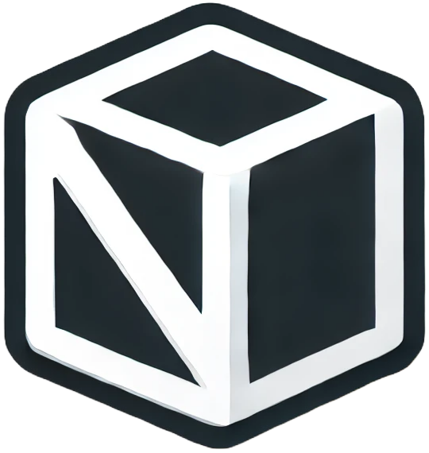

  
  <h1>NextBox</h1>

A collection of libraries for use primarily with Next.js.

- [@next-box/breadcrumb](./packages/breadcrumb/README.md)
- [@next-box/envs](./packages/envs/README.md)
- [@next-box/feature-flags](./packages/feature-flags/README.md)
- [@next-box/i18n](./packages/i18n/README.md)
- [@next-box/link-extra](./packages/link-extra/README.md)

## Changelog

Check out the [features, fixes and more](CHANGELOG.md) that go into each major, minor and patch version.

## License

NextBox is [MIT Licensed](LICENSE).
